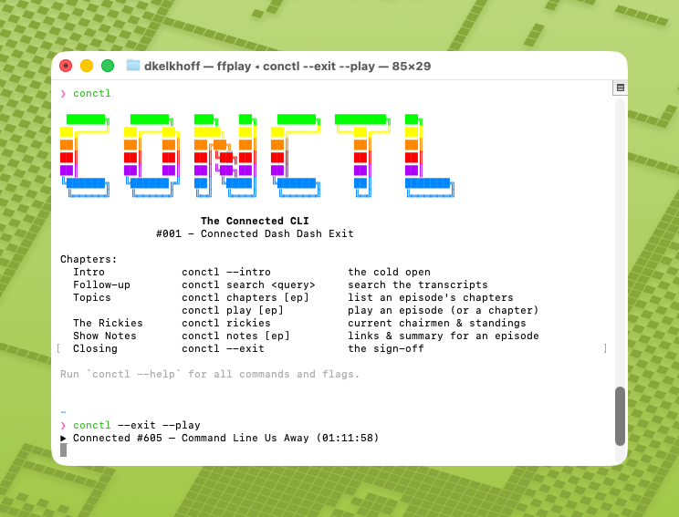

# conctl: The Connected CLI

A command-line companion app for the [Connected](https://relay.fm/connected) podcast.  Built for fans, hosts, AI agents, and mostly just because Stephen mentioned it as a joke once.

```text
 ██████╗   ██████╗   ███╗   ██╗   ██████╗  ████████╗  ██╗
██╔════╝  ██╔═══██╗  ████╗  ██║  ██╔════╝  ╚══██╔══╝  ██║
██║       ██║   ██║  ██╔██╗ ██║  ██║          ██║     ██║
██║       ██║   ██║  ██║╚██╗██║  ██║          ██║     ██║
██║       ██║   ██║  ██║╚██╗██║  ██║          ██║     ██║
╚██████╗  ╚██████╔╝  ██║ ╚████║  ╚██████╗     ██║     ███████╗
 ╚═════╝   ╚═════╝   ╚═╝  ╚═══╝   ╚═════╝     ╚═╝     ╚══════╝
                     The Connected CLI
```

`conctl` can search the show's unofficial transcripts, print lists of chapters, dump show notes, track the Rickies, and more.  

It was inspired by Stephen saying "`connected --exit`" on [episode 605](https://relay.fm/connected/605), after hearing about [remctl](https://www.macstories.net/stories/introducing-remctl-the-power-user-reminders-cli-for-macos-and-ai-agents/). Like `remctl`, `conctl` produces human-readable terminal output by default, but can also produce JSON for agents to consume.  



## How It Works
`conctl` is a single, self-contained Go binary that stitches together the public data the show already publishes:

- episodes, chapters, and show notes come from the Connected RSS feed.
- transcripts are from podcastsearch.david-smith.org (thank you David Smith)
- the Rickies data comes from rickies.net/api/v1 (thanks to Jason Biatek) and https://rickies.co (thanks Lex Postma)
- local AI (via the `--llm` flag calls your your already-installed claude / codex CLI

## Quick Start

### Via Homebrew
```bash
brew install darinkelkhoff/tap/conctl

conctl                       # print the show banner with a rundown of commands
conctl search "vision pro"   # search transcripts, deep-linked to the second
conctl rickies               # print current title holders
conctl --exit                # text of the sign-off (the final chapter of the latest *transcribed* episode)
conctl --exit --play         # play the audio of the sign-off
```

Full-episode playback uses `afplay` (built into macOS) when available, then `ffplay`/`ffmpeg`. Chapter/segment playback (intro, exit, `--chapter`) needs `ffplay` or `ffmpeg` (`brew install ffmpeg`). The Homebrew formula declares `ffmpeg` as an optional dependency.
### From source

```bash
git clone https://github.com/darinkelkhoff/connectedCli.git
cd connectedCli
just build            # -> ./bin/conctl   (or: go build -o bin/conctl ./cmd/conctl)
./bin/conctl --help
```

## Command Map

| Area             | Commands                                                                          |
| ---------------- | --------------------------------------------------------------------------------- |
| Episode info     | `latest`, `latest --full`, `chapters [ep]`, `notes [ep]`                         |
| Search           | `search <query>`                                                                  |
| Play audio       | `play [ep]`, `play --first`, `play --last`, `play --chapter N`                   |
| Intro / cold open| `intro [ep]`, `intro --short`, `intro --say`, `intro --play`, `intro --llm`      |
| Exit / sign-off  | `exit [ep]`, `exit --short`, `exit --say`, `exit --play`, `exit --llm`           |
| Rickies          | `rickies titles [host]`, `rickies games`, `rickies game <name>`, `rickies bill`  |
| Agent / JSON     | add `--json` to any command                                                       |

### Common examples

```bash
conctl latest                           # title and link to the most recent episode
conctl latest --full                    # episode + chapters + show notes
conctl chapters 605                     # list an episode's chapters
conctl notes 605                        # show notes & links for an episode
conctl search "liquid glass" --limit 5  # transcript hits, grouped by episode

conctl intro                            # cold open of the latest episode (transcript)
conctl intro --short                    # just the first sentence
conctl intro --short --say              # ...spoken aloud
conctl intro --play                     # stream the intro audio (needs ffplay/ffmpeg)
conctl intro --llm --prompt cold-open   # AI-generated cold open from your local CLI

conctl exit                             # sign-off of the latest episode (transcript)
conctl exit --short                     # Arrivederci. Cheerio. Bye, y'all.
conctl exit --short --say               # ...spoken aloud
conctl exit 601 --llm --prompt haiku    # the episode as a haiku

conctl play 605                         # stream the full episode audio
conctl play --last                      # stream the last chapter (needs ffplay/ffmpeg)
conctl play 605 --chapter 7             # stream one chapter by index

conctl rickies titles                   # current chairmen and all titles
conctl rickies titles Federico          # one host's titles
conctl rickies games                    # every Rickies game ever played
conctl rickies game "2025 WWDC Rickies" # one game's picks and scores
conctl rickies bill                     # the current Bill of Rickies

conctl --exit                           # the joke: works as a root flag too
conctl search "siri" --json             # structured output for agents (any command)
```

## Chapters, Intros & Exits

Every episode's chapters come from the MP3's embedded ID3 chapter markers. `conctl` treats the **first** chapter as the intro and the last one as the exit.  Note that commands which output text do require transcripts to be posted.  Commands with `--play` work from the podcast mp3's, so do not require transcripts.

```bash
conctl chapters 605      # list chpaters
conctl intro             # first chapter of the latest episode
conctl exit              # last chapter of the latest episode
conctl play --last       # play the last chapter (needs ffplay or ffmpeg)
```

The `intro` and `exit` subcommands share a set of render modes (choose at most one):

| flag        | what you get                                                        |
| ----------- | ------------------------------------------------------------------- |
| *(default)* | the chapter's transcript text — no dependencies                     |
| `--play`    | streams just that chapter's audio (needs `ffplay` or `ffmpeg`)      |
| `--say`     | macOS `say` reads the chapter aloud                                 |
| `--llm`     | a local AI CLI (`claude` / `codex`) generates text from the chapter |
| `--short`   | just the quick sign-offs or first sentence of the intro.            |
| `--json`    | structured output - ideal for consumption by an LLM                 |

You can target any specific episode with a positional number (`conctl intro 601`); the default is the latest episode (*latest transcribed episode, when requesting text instead of audio*). While the actual commands here are `intro` and `exit`, you can say `conctl --exit` - or, for bonus points, can create an alias in your shell `alias connected=conctl`, to use the literal `connected --exit` as foretold by Stephen.  

## Search

`conctl search <query>` runs against David Smith's Whisper transcripts and groups results by episode, with the matched term highlighted. In a terminal, each timestamp is a clickable link to that exact second on the transcript site:

```text
#601 I Love Wrists:
  01:40:25  … the best thing you can say about the Vision Pro, I think. …
  01:40:19  … Tim Cook says about the Vision Pro, it's tomorrow's engineering …
```

Add `--json` for `{episodeNumber, episodeTitle, time, seconds, snippet, url}` objects.

## The Rickies

`conctl` reads the [rickies.net](https://rickies.net/) API and reads the Bill of Rickes from rickes.co:

```bash
conctl rickies                 # a Rickies banner plus list of subcommands
conctl rickies bill            # the full current Bill of Rickies (the rules)
conctl rickies bill --versions # list every past edition of the bill
conctl rickies bill --version annual-2017   # print a past edition
conctl rickies bill diff annual-2017 annual-2018   # diff two editions
conctl rickies bill --say      # read the bill aloud (macOS say)
conctl rickies titles          # print all current titles
conctl rickies titles Stephen  # one host's titles
conctl rickies games           # every Rickies game, 2017 -> today
conctl rickies game "2026 March"   # one game in detail
```

`rickies bill` reconstructs the **current** rules from the date-versioned [Bill of Rickies](https://rickies.co/billof) — keeping only the rules (and inline edits) in force today. `--versions` lists all 35 past editions (the page's history slider), and `--version <slug|index>` prints any of them as they stood at that date.

`rickies game <name>` shows the main round and the flexies for a game — the winner, each host's score, and every pick grouped by host with a ✓/✗ for whether it hit, plus the flexies' charity. The name is matched fuzzily (a unique substring is enough).

A host with no current titles is, of course, declared to be the **Man of the People** (looking at you, Myke).
## Show Notes

Each episode's show notes are available in the RSS feed, so this works for every episode (no transcript needed):

```bash
conctl notes        # latest episode
conctl notes 600    # a specific episode
conctl notes --json # { episode, title, summary, links: [{text, url}] }
```

## Local AI (`--llm`)

`--llm` rewrites a chapter using an AI CLI **that you already have installed**. You don't set up any API keys or install anything new. It checks for `claude` (`claude -p`), then `codex` (`codex exec`), and uses the first one it finds.

```bash
conctl exit 601 --llm                    # a closing summary in the show's voice
conctl exit 601 --llm --prompt haiku     # the episode as a haiku
conctl intro 601 --llm --say             # an AI cold-open, read aloud
```

Prompt presets (`--prompt`): `conclusion` (default for `--exit`), `cold-open` (default for `--intro`), `recap`, `style-federico`, `style-myke`, `style-stephen`, `haiku`. A spinner shows while your local model thinks.

## For Agents

Every command accepts `--json` and writes machine-readable output to stdout; notes, spinners, and progress go to stderr, so piping stdout stays clean.

```bash
conctl search "siri" --json | jq '.[0]'
conctl chapters 605 --json
conctl rickies --json
conctl notes --json
conctl exit 601 --json                # { episode, chapter, text }
```

Because `conctl` reads only public data and never writes anything, it's safe to hand to an agent.  I mean, as safe as anything vibe-coded could be. 

A ready-to-use agent guide — with the full `--json` schemas, caveats, and `jq` recipes — lives in [`SKILL.md`](SKILL.md).

## Notes & Caveats
- **Transcripts lag the feed.** David Smith re-transcribes episodes on a delay, so the newest episode or two may not be searchable yet. For `--intro`/`--exit` text/`--say`/`--llm`, conctl automatically falls back to the newest transcribed episode (with a note on stderr). `--play` always works — chapters and audio
  come straight from the MP3.
- **`--play`** uses `afplay` (built into macOS) for full-episode playback, with no extra dependencies. Chapter and segment playback (`intro --play`, `exit --play`, `play --chapter N`) needs `ffplay` or `ffmpeg` — `brew install ffmpeg` gets you both. The Homebrew formula declares `ffmpeg` as an optional dependency. All other modes are dependency-free (`say` is built into macOS).
- **`--llm` needs a local agent CLI** (`claude` or `codex`); otherwise it prints a friendly "no local AI found" message.

## Development
Building from source, project layout, and the release process live in [DEVELOPMENT.md](DEVELOPMENT.md).

## Credits
`conctl` was built by [Claude](https://claude.ai) (Anthropic), directed by [Darin Kelkhoff](https://kelkhoff.com) - a Relay fan. 

It couldn't exist without the following members of the community:
- [Connected](https://relay.fm/connected) by Myke Hurley, Federico Viticci, and Stephen Hackett (Relay (probably not) FM)
- [Podcast Search](https://podcastsearch.david-smith.org/) by David Smith
- [rickies.net](https://rickies.net/) by jbiatek
- [rickies.co](https://rickies.co/) by Lex Postma
- Inspired by [remctl](https://github.com/viticci/remctl) by Federico Viticci

## License

MIT. See [LICENSE](LICENSE).
